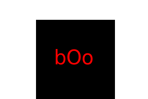
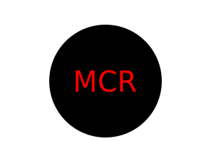
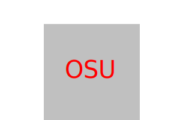
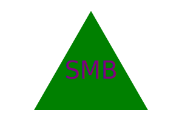

# logo_maker
Object-oriented Programming: SVG Logo Maker

# Description
This project was started as a way for a user to generate a simple logo or monogram with only a few input. This was able to be achived by using Inquirer in the command line. From there I was able to select a few questions for the user to respond to and take there response and create an SVG file. With that SVG file it allows the user to have an image that is not only scalebale in size, but is also customized to the color, shape and even with the characters of their choosing.  

# Table of Content

1. [Description](#description)
2. [Demonstration](#demonstration)
3. [Examples](#examples)
4. [Usage](#usage)
5. [Credits](#credits)
6. [License](#license)
7. [Features](#features)

# Demonstration
Link to google drive video submission can be found here -> [video submission](https://drive.google.com/file/d/18nfSES8Q6jEGCvyCccNTlnzDlxkeu6fc/view)

# Examples

   
# Usage
from the command line clone this repo. From there you can initiate the app using the command "node index.js".
* Requires these be installed before initialization
* [Node.JS](https://nodejs.org/en)
* [Inquirer Ver.8.2.4](https://www.npmjs.com/package/inquirer/v/8.2.4)
* [Jest Ver.24.9.0](https://archive.jestjs.io/docs/en/24.x/getting-started.html) 

# Credits
Source code was taken from the "OSU-VIRT-FSF-PT-08-2023-U-LOLC" repository. Lessons from module 10-OPP and 11-Express from the previously mentioned repository were used as a reference point for where to begin. 
Stack Overflow was used as a reference and to help when problems came up that needed trouble shooting("e.g" Inquirer not running a prompt with the latest update and needing to be set back to Ver.8)

# License

* [MIT License link](https://github.com/git/git-scm.com/blob/main/MIT-LICENSE.txt)
  
Copyright (c) 2012-2023 Scott Chacon and others

Permission is hereby granted, free of charge, to any person obtaining
a copy of this software and associated documentation files (the
"Software"), to deal in the Software without restriction, including
without limitation the rights to use, copy, modify, merge, publish,
distribute, sublicense, and/or sell copies of the Software, and to
permit persons to whom the Software is furnished to do so, subject to
the following conditions:

The above copyright notice and this permission notice shall be
included in all copies or substantial portions of the Software.

THE SOFTWARE IS PROVIDED "AS IS", WITHOUT WARRANTY OF ANY KIND,
EXPRESS OR IMPLIED, INCLUDING BUT NOT LIMITED TO THE WARRANTIES OF
MERCHANTABILITY, FITNESS FOR A PARTICULAR PURPOSE AND
NONINFRINGEMENT. IN NO EVENT SHALL THE AUTHORS OR COPYRIGHT HOLDERS BE
LIABLE FOR ANY CLAIM, DAMAGES OR OTHER LIABILITY, WHETHER IN AN ACTION
OF CONTRACT, TORT OR OTHERWISE, ARISING FROM, OUT OF OR IN CONNECTION
WITH THE SOFTWARE OR THE USE OR OTHER DEALINGS IN THE SOFTWARE.
    
   
# Features
The project features the ability to to generate a simple SVG logo with only a few user inputs and no other tools.